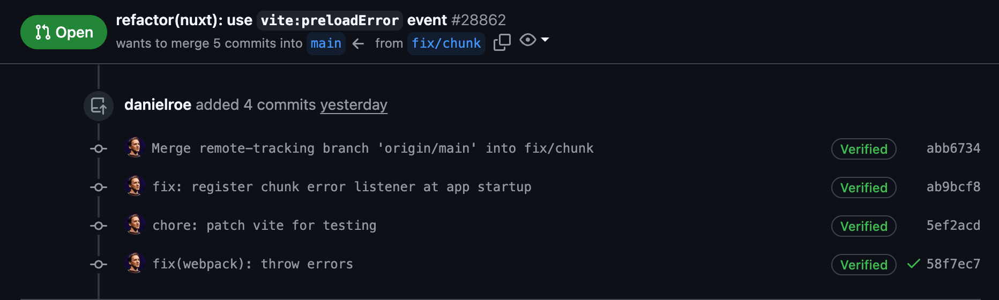
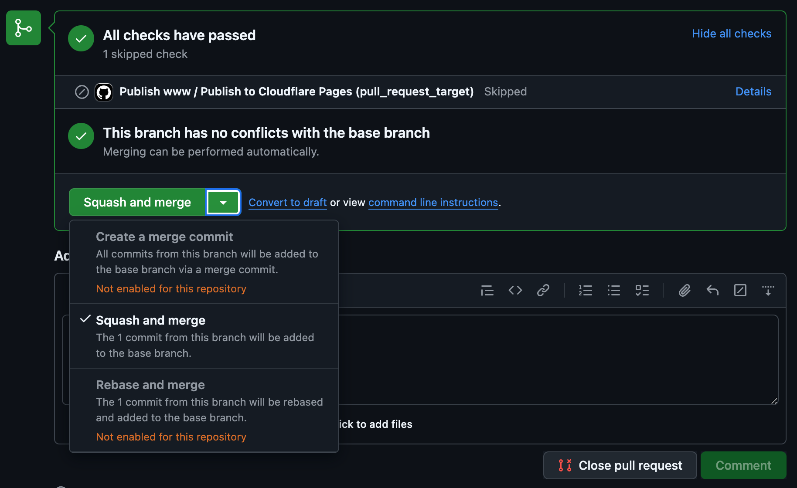

---
# You can also start simply with 'default'
theme: apple-basic
title: Git & Workflow
class: text-center flex items-center justify-center flex-col h-full
# https://sli.dev/features/drawing
drawings:
  persist: false
# slide transition: https://sli.dev/guide/animations.html#slide-transitions
transition: fade
# enable MDC Syntax: https://sli.dev/features/mdc
mdc: true
---

# Git & Workflow

Tips & Tricks to make your life easier

---

## Commits

<br />

Commits naming needs to be clear and concise

- Commits should be small
- Commits should be descriptive
- Commits should be related to a ticket

Standart for all big projects is to use [Conventional Commits](https://www.conventionalcommits.org/en/v1.0.0/)


---

## How to write a good commit message

<br />

````md magic-move
```js
<type>
```
```js
<type>[optional scope]:
```
```js
<type>[optional scope]: <description>
```
```js
<type>[optional scope]: <description>

[optional body]
```
```ts
<type>[optional scope]: <description>

[optional body]

[optional footer(s)]
```
```ts
// Can be 'fix', 'feat', 'chore', 'docs', 'style', 'refactor', 'perf', 'test', 'revert', 'ci', 'build', 'release'
fix
```
```ts
fix(Dropdown): 
```
```ts
fix(Dropdown): content position
```
```ts 
fix(Dropdown): content position

Add a new prop to control the position of the content
```
```ts
// Breaking change
feat!(Calendar): move to `@internationalized/date` package
    👆

// Commit footer
BREAKING CHANGE: The `Calendar` component has been moved to `@internationalized/date` package
```
````

---

## Good commit examples

<br />
<br />



---

## Merge strategies

<br />

<div class="flex justify-center items-center">
  
</div>

---

## Other tips

<br />

- Don't forget to fetch before creating a new branch
- Before creating PR, merge target branch into your branch
- Always squash commits after merge, to keep history clean
- Rebase not recommended, can rewrite history

<br />

### Use tools for faster and easier workflow

The best tool I know is [GitLens](https://marketplace.visualstudio.com/items?itemName=eamodio.gitlens)

<br />

### Stashes and worktrees

Stashes are great for temporary commits, but they can be hard to manage. If you need to clone a repo and make some changes in parallel, you can use worktrees.

---

## PR example

<br />

It is very important to have a good PR description with all the necessary information of changes, and a link to the ticket. Also it is great to attach a screenshot or a video of the changes.

Here is an example of a good PR description: [PR link](https://github.com/radix-vue/radix-vue/pull/1257)

---

## Automation tools

<br />

List of tools that help with configuring git hooks and automating tasks, that needs to be shared across team.

- [Simple-git-hooks](https://github.com/toplenboren/simple-git-hooks)
- [Husky](https://typicode.github.io/husky/)
- [Lint-staged](https://github.com/lint-staged/lint-staged)
- [Commitlint](https://commitlint.js.org/)

---
class: text-center flex items-center justify-center flex-col h-full
---

# Thank you!
